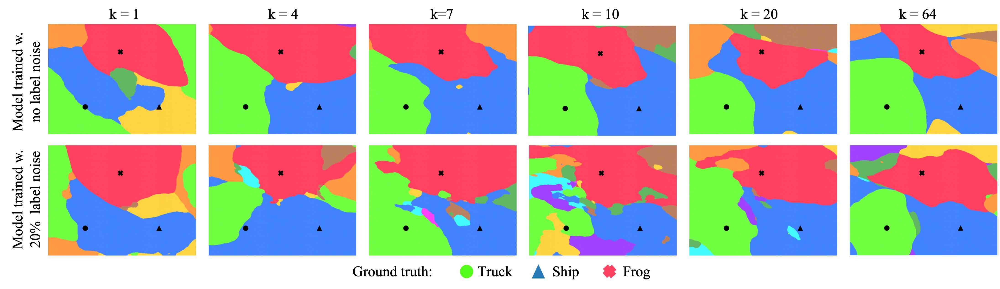

# Double Descent experiments

First train the models by running the following script.

```
bash script_train.sh
```

Generate decision surfaces using following code.
```
python db_plot.py --k <model_k> --imgs <images_ids_to_plot> --range_l 0.5 --range_r 0.5 --plot_path <path_to_store_images> --plot_method train_ids --noise_rate <noise_value>
```

Calculate the fragmentation scores by running following script.
```
bash script_frag.sh
```

Calculate the reproducibility scores by running following script.
```
bash script_reproscores.sh
```

Calculate the margins by running following script.
```
bash script_margins.sh
```

Recreate the plots from the paper by running following bash script.
```
bash script_dd_plots.sh
```
